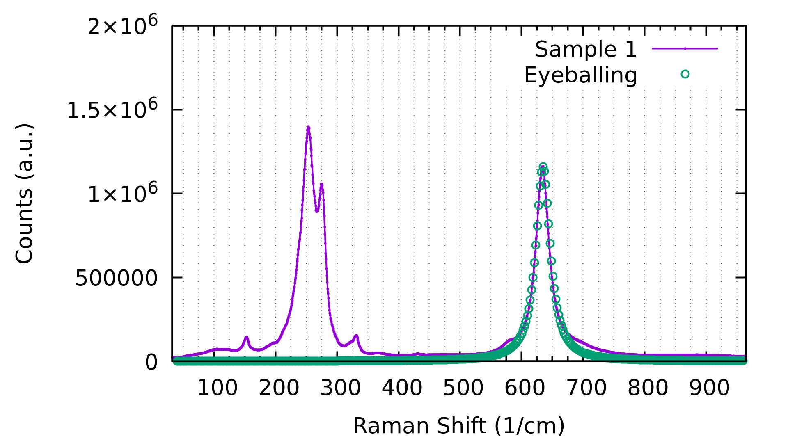
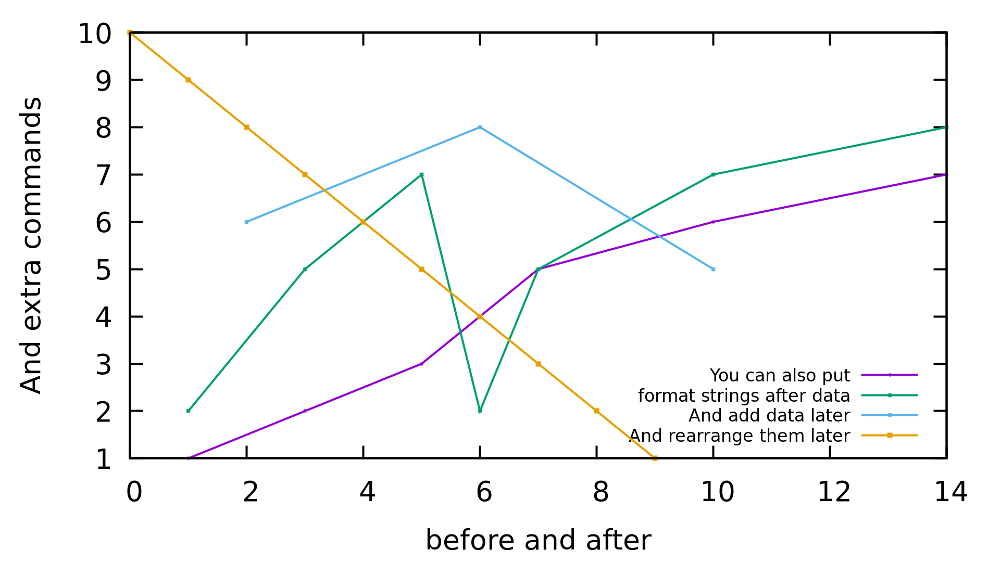
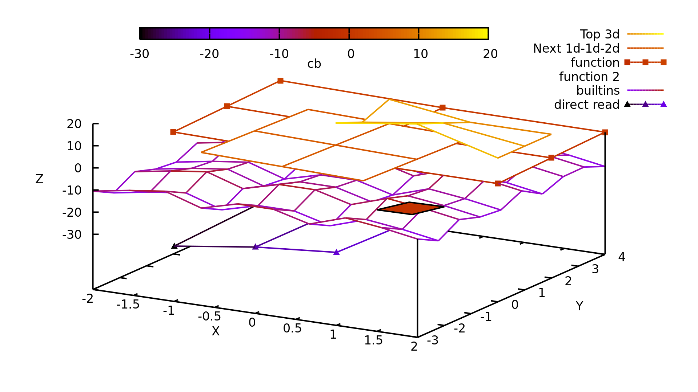

# cl-gnuplot

Interact with gnuplot via common lisp in a simple, intuitive manner. Made specifically for easy plotting of 2d and 3d data.

# Quick Example
```
(require 'cl-gnuplot)
(plt:reset)
(plt:plot (plt:basic-read-file "./resources/quick-example-file.txt" :manual-delim #\tab) "w lp title 'Sample 1'"
          :yrange "[*:2e6]"
          :xlabel "'Raman Shift (1/cm)'"
          :ylabel "'Counts (a.u.)'"
          :grid "x mx"
          :xtics "0,100,1000"
          :mxtics "4")
(plt:plot-function :function (lambda (x) (/ (* 200 1.16d6) (+ (expt (- x 635) 2) 200)))
                   :x (plt:linspace 40 960 :len 400)
                   :plot-format "w p pt 6 ps 3 title 'Eyeballing'"
                   :add t)
				   
(plt:save-last-plot "pngcairo lw 4 font ',40' size 1920,1080" "./resources/quick-example.png")
```


# 2D Plotting
Default is "with linespoints" ("w lp"). You must use a format string with "with lines" ("w l") or "with points" ("w p") do just do one or the other.
```
(require 'cl-gnuplot)
(plt:reset)
(plt:plot '((1 2) (3 5) (5 7) (6 2) (7 5) (10 7) (14 8)) ;; 2d data as pairs of xy data
          '(1 3 5 6 7 10 14) '(1 2 3 4 5 6 7) ;; 2d data as a list of x and a list of y data
          '(10 9 8 7 6 5 4 3 2 1) ;; 2d data as just a list of y data (assuming 0,1,2... as x data)
          )
(plt:plot plt::example-2d-data "w lp title 'format strings after data'"
          '(10 9 8 7 6 5 4 3 2 1) "w lp title 'And rearrange them later'"
          '(1 3 5 6 7 10 14) '(1 2 3 4 5 6 7) "w lp title 'You can also put'"
          :ylabel "'And extra commands'"
          :xlabel "'before and after'")
(plt:plot-add '((2 6) (6 8) (10 5)) "w lp title 'And add data later'"
          :key "bottom right font ',25'")
		  
(plt:rearrange-plots '(2 0 3 1)) ;; Shuffle the plots into a more desirable order
(plt:resend-plots) ;; Different than replot which just send "replot" to gnuplot. This resends all plot information.

(plt:save-last-plot "pngcairo lw 4 font ',40' size 1920,1080" "./resources/2d-plotting.png")
```


## More Niche 2D Stuff
For reference.
```
(require 'cl-gnuplot)
(plt:reset)

```

TODO: Add a multiplot with all the other kinds of 2d plots (bar, violin, histo, etc.) since they're as easy as just adding a format string.

# 3D Plotting
Default is "with pm3d". You must use a format string "with lines" ("w l") to do wireframe style plots.
```
(require 'cl-gnuplot)
(plt:reset)
(plt:plot :terminal "qt lw 4 font ',25' size 1920,1080"
          '(((0 0 5) (1 0 10) (2 0 0))
            ((0 1 0) (1 1 5) (2 1 0))
            ((0 2 5) (1 2 0) (2 2 0))) "w l pal title 'Top'" ;; 3d data as sets of xyz data
          '(-1 0 1) '(-2 0 2) 
          '((-4 -3 -2) (-4 -5 -6) (0 0 -1)) "w l pal title 'Bottom'" ;; 3d data as x list, y list, then z matrix
          :hidden3d ""
          :xlabel "'X'" :ylabel "'Y'" :zlabel "'Z'" :cblabel "'cb'"
          :view "50,20")

(plt:save-last-plot "pngcairo lw 4 font ',25' size 1920,1080" "./resources/3d-plotting.png")
```


## 3D Data Loading and Heatmap
```
(require 'cl-gnuplot)
(plt:reset)
(plt:plot :terminal "qt lw 4 font ',25' size 1920,1080" 
          (plt:partition 81 (plt:basic-read-file "./resources/3d-data-example.txt")) "u 1:2:8 w pm3d notitle"
          :pm3d "at sb depthorder"
          :view "60,30"
          :xlabel "'X'" :ylabel "'Y'" :cblabel "'Z (a.u.)'"
          :ztics "unset" :border "15" :xtics "offset 0,-0.25")
(plt:save-last-plot "pngcairo lw 4 font ',25' size 1920,1080" "./resources/3d-file-plotting.png")
```


# Typical Commands

```
;;; Loading
(require 'cl-gnuplot) ;; nicknamed plt ;; Automatically spins up a gnuplot process

;;; Inquiring
(plt:help :xtics)
(plt:show :terminal\ pngcairo)

;;; 2D plotting
(plt:reset)
(plt:send-plot-options :terminal "qt enhanced font 'arial,32' size 1920,1080")
(plt:plot "cos(2*x)+3" '(1 2 3) '(4 5 6) :xrange "[*:4]" :yrange "[0:7]" :grid "" :key "bottom left opaque")
(plt:plot-add '(2 3 4) "w lp title 'added line'")

;;; 3D plotting
(plt:reset)
(plt:send-plot-options :terminal "qt enhanced font 'arial,32' size 1920,1080")
(plt:plot "cos(2*x)+sin(2*y)+15 w pm3d")
(plt:plot-add '(((0 0 3) (3 0 0) (5 0 -3)) ((0 2 0) (3 2 -3) (5 2 0)) ((0 6 -3) (3 6 0) (5 6 3))) "u 1:2:3 w pm3d title '3d matrix'"
              '(0 3 5) '(0 2 6) '((0 1 2) (4 5 6) (9 10 11)) "u 1:2:3 w pm3d title 'vector-vector-2d matrix'")
(plt:send-plot-options-and-replot :pm3d "depthorder" :zlabel "rotate parallel" :key "opaque")

;;; Multiplot
(plt:reset)
(plt:multiplot "layout 2,2 title 'Multiplot Title'"
	(list '(1 2 3 4) "w lp title 'plot 1'" '(2 1 4 3) "w lp title 'Double plot!'"
          :xlabel "'Amps'" :ylabel "'Fun'" :key "top left" :grid "")
	(list '(10 25 30) "w lp title 'plot 2'" :xlabel "'Bees'")
	(list '(1 0 3 10) "w lp title 'plot 3'" :xlabel "'Volts'" :key "unset")
	(list '(-2 -4 -6 2) "w lp title 'plot 4'" :xlabel "'Dogs'" :grid "unset" :mxtics "10"))
							 
;;; Saving
(plt:plot plt::example-3d-data)
(plt:save-last-plot "pngcairo" "myfilename.png")
(plt:save-plot "pngcairo" "myfilename.png"
    (plt:plot plt::example-2d-data))
(plt:save-gnuplot-script "myscript.gp")
(plt:load-gnuplot-script "myscript.gp")
(plt:replot)

;;; Panicking
(plt:restart-gnuplot)
(plt:help-cl-gnuplot)

;;; Useful Utilities
(plt:basic-read-file "filename")
(plt:plot-function :function (lambda (x) (/ (x + 4)) :x (plt:linspace 0 10 :len 100))
(plt:linspace 0 10 :step 1 :type 'integer)
(plt:range 0 -5)
(plt:transpose (plt:range 5) '(3.4 6.7 -2.3 4.5))
```

# Just Let Me Use Gnuplot Syntax Dangit
```
(plt:send-strings (list "set terminal qt enhanced font 'arial,16' size 1920,1080"
                        "plot 'mydata.txt' w lp u 1:2 title 'override'"
                        "set xlabel 'Booyah' font ',300'"))
```

## License

GPLv3
