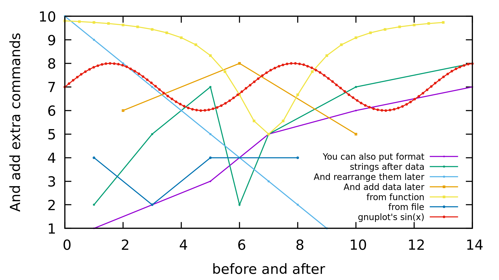
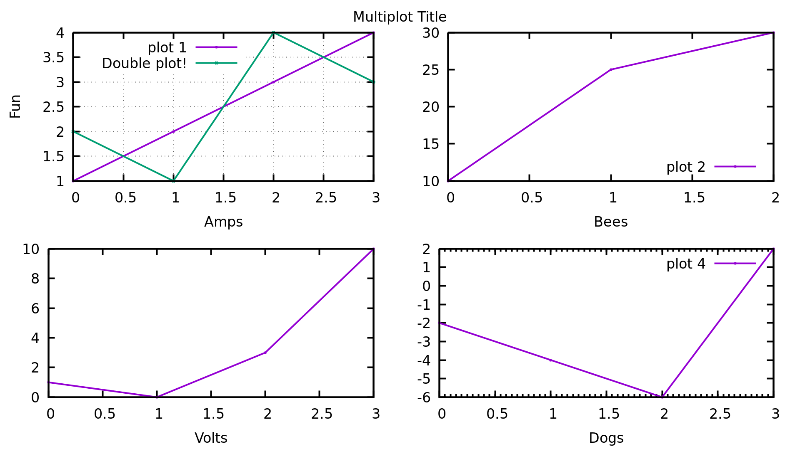

# cl-gnuplot

Interact with gnuplot via common lisp in a simple, intuitive manner. Made specifically for easy plotting of 2d and 3d data.

# Quick Example
Load data with plt:basic-read-file, plot functions by providing x data and a function, throw it all into one call to plt:plot with all your settings and you're off to the races. ```(plt:help :grid)``` will print gnuplot help info for grid (or any other command). ```(plt:show :grid)``` prints the current state of grid (or any other command).
```
(require 'cl-gnuplot)
(plt:reset)
(plt:plot (plt:basic-read-file "./resources/quick-example-file.txt" :manual-delim #\tab) "w lp title 'Sample 1'"
          (plt:linspace 40 960 :len 400) (lambda (x) (/ (* 200 1.16d6) (+ (expt (- x 635) 2) 200))) "w p pt 6 ps 3 title 'Eyeballing'"
          :yrange "[*:2e6]"
          :xlabel "'Raman Shift (1/cm)'"
          :ylabel "'Counts (a.u.)'"
          :grid "x mx"
          :xtics "0,100,1000"
          :mxtics "4")

(plt:save-last-plot "pngcairo lw 4 font ',40' size 1920,1080" "./resources/quick-example.png")
```


# 2D Plotting
Default is "with linespoints" ("w lp"). You must use a format string with "with lines" ("w l") or "with points" ("w p") do just do one or the other.

Below is an example of all the different accepted ways to make a 2d plot by the 'plot' function.
* xy pairs list
* x-list y-list
* x-list function
* y-list
* gnuplot builtin, e.g. "airy(x)"
* direct file read
```
(require 'cl-gnuplot)
(plt:reset)
;; Data w/o format strings for quick plotting
(plt:plot '((1 2) (3 5) (5 7) (6 2) (7 5) (10 7) (14 8)) ;; 2d data as pairs of xy data
          '(1 3 5 6 7 10 14) '(1 2 3 4 5 6 7) ;; 2d data as a list of x and a list of y data
          (plt:linspace 0 13 :step 0.5) (lambda (x) (- 10 (/ 10 (+ 2 (expt (- x 7) 2))))) ;; 2d data as a list of x data followed by a function
          ;; 1d data all by itself (with no format string) can only appear as the last data item
          '(10 9 8 7 6 5 4 3 2 1) ;; 2d data as just a list of y data (assuming 0,1,2... as x data)
          )

;; Data with format strings (can also mix and match)
(plt:plot :terminal "qt lw 4 font ',40' size 1920,1080"
          plt::example-2d-data "w lp title 'strings after data'"
          (plt:linspace 0 13 :step 0.5) (lambda (x) (- 10 (/ 10 (+ 2 (expt (- x 7) 2))))) "w lp title 'from function'"
          '(10 9 8 7 6 5 4 3 2 1) "w lp title 'And rearrange them later'"
          '(1 3 5 6 7 10 14) '(1 2 3 4 5 6 7) "w lp title 'You can also put format'"
		  "7+sin(x) w lp title 'gnuplot''s sin(x)'"
		  "'./resources/2d-plotting-example.txt' w lp title 'from file'"
          :ylabel "'And add extra commands'"
          :xlabel "'before and after'")
(plt:plot-add '((2 6) (6 8) (10 5)) "w lp title 'And add data later'"
          :key "bottom right font ',25'")

(plt:rearrange-plots '(3 0 2 6 1 5 4)) ;; Shuffle the plots into a more desirable order
(plt:resend-plots) ;; Different than (plt:replot) which just sends "replot" to gnuplot. This resends all plot information.

(plt:save-last-plot "pngcairo lw 4 font ',40' size 1920,1080" "./resources/2d-plotting.png")
```


## More Niche 2D Plotting
For reference.
```
(require 'cl-gnuplot)
(plt:reset)

```

TODO: Add a multiplot with all the other kinds of 2d plots (bar, violin, histo, etc.) since they're as easy as just adding format strings and settings.

# 3D Plotting
Default is "with pm3d". You must use a format string "with lines" ("w l") to do wireframe style plots.

Below are all the ways to make a 3d plot via the 'plot' function.
* xyz sets with multiple rows
* x-list y-list z-matrix
* x-list y-list function
* gnuplot builtin, e.g. "airy(x) + cos(y)"
* direct file read
```
(require 'cl-gnuplot)
(plt:reset)
(plt:string-code-to-3d) ;; Hopefully temporary, forces pure string inputs (builtin, direct read) to use splot
(plt:plot :terminal "qt lw 4 font ',25' size 1920,1080"
          '(((0 0 15) (1 0 20) (2 0 10))
            ((0 1 10) (1 1 15) (2 1 10))
            ((0 2 15) (1 2 10) (2 2 10))) "w l pal title 'Top 3d'" ;; 3d data as sets of sets of xyz data
          '(-2 0 2) '(0 2 4) (lambda (x y) (+ (sin x) (cos y))) "w lp ps 2 pal title 'function'"
		  '(-1 0 1) '(-2 0 2) 
          '((7 6 5) (6 5 4) (5 4 3)) "w l pal title 'Next 1d-1d-2d'" ;; 3d data as x list, y list, then z matrix
          "-10 + 3*(cos(5*x) - sin(5*y)) w l pal title 'builtins'"
          "'./resources/quick-3d-data.txt' w lp ps 2 pal title 'direct read'"
          :hidden3d ""
          :xlabel "'X'" :ylabel "'Y'" :zlabel "'Z'" :cblabel "'cb' offset 0,1" :colorbox "horizontal user origin 0.2,0.9 size 0.5,0.03"
          :xtics "offset 0,-0.3"
          :view "60,30")
		  
(plt:rearrange-plots '(0 2 1 3 4))
(plt:resend-plots)

(plt:save-last-plot "pngcairo lw 4 font ',25' size 1920,1080" "./resources/3d-plotting.png")
```


## 3D Data Loading and Heatmaps
This can be done via a direct read (with string-code-to-3d) or 'basic-read-file' and 'partition'. Option 2 is great when you need to get the data and do manipulations like derivatives, background subtraction, scaling, etc.
```
(require 'cl-gnuplot)
(plt:reset)

(plt:plot :terminal "qt lw 4 font ',25' size 1920,1080" 
          (plt:partition 81 (plt:basic-read-file "./resources/3d-data-example.txt")) "u 1:2:8 w pm3d notitle"
          :pm3d "at sb depthorder"
          :view "60,30"
          :xlabel "'X'" :ylabel "'Y'" :cblabel "'Z (a.u.)'"
          :ztics "unset" :border "15" :xtics "offset 0,-0.25")
(plt:save-last-plot "pngcairo lw 4 font ',25' size 1920,1080" "./resources/3d-file-plotting.png")
```


# Multiplot
Multiplot works by wrapping multiple plots inside one function call. The 'layout' option allows for easy position of plots on a grid. You can also forgo using 'layout' and manually position plots via the 'origin' and 'size' options in the individual plot arguments. Besides that, everything in the 4 plots below is the exact same syntax as what would be given to a 'plot' call like above.

'save-last-plot' does not work with multiplot. Instead, the macro 'save-plot' is wrapped around the function. 'save-plot' will also work with any plots that do not 'replot' properly ('save-last-plot' uses 'replot' to capture the last plot).
```
(require 'cl-gnuplot)
(plt:reset)
(plt:save-plot ("pngcairo lw 4 font ',25' size 1920,1080" "./resources/multiplot.png") 
               (plt:multiplot "layout 2,2 title 'Multiplot Title'"
                              (list '(1 2 3 4) "w lp title 'plot 1'" '(2 1 4 3) "w lp title 'Double plot!'"
                                    :xlabel "'Amps'" :ylabel "'Fun'" :key "top left" :grid "")
                              (list '(10 25 30) "w lp title 'plot 2'" :xlabel "'Bees'")
                              (list '(1 0 3 10) "w lp title 'plot 3'" :xlabel "'Volts'" :key "unset")
                              (list '(-2 -4 -6 2) "w lp title 'plot 4'" :xlabel "'Dogs'" :grid "unset" :mxtics "10")))
```


# Typical Commands

```
;;; Loading
(require 'cl-gnuplot) ;; nicknamed plt ;; Automatically spins up a gnuplot process

;;; Inquiring
(plt:help :xtics)
(plt:show :terminal\ pngcairo)

;;; 2D plotting
(plt:reset)
(plt:send-plot-options :terminal "qt enhanced font 'arial,32' size 1920,1080")
(plt:plot "cos(2*x)+3" '(1 2 3) '(4 5 6) :xrange "[*:4]" :yrange "[0:7]" :grid "" :key "bottom left opaque")
(plt:plot-add '(2 3 4) "w lp title 'added line'")

;;; 3D plotting
(plt:reset)
(plt:send-plot-options :terminal "qt enhanced font 'arial,32' size 1920,1080")
(plt:plot "cos(2*x)+sin(2*y)+15 w pm3d")
(plt:plot-add '(((0 0 3) (3 0 0) (5 0 -3)) ((0 2 0) (3 2 -3) (5 2 0)) ((0 6 -3) (3 6 0) (5 6 3))) "u 1:2:3 w pm3d title '3d matrix'"
              '(0 3 5) '(0 2 6) '((0 1 2) (4 5 6) (9 10 11)) "u 1:2:3 w pm3d title 'vector-vector-2d matrix'")
(plt:send-plot-options-and-replot :pm3d "depthorder" :zlabel "rotate parallel" :key "opaque")

;;; Multiplot
(plt:reset)
(plt:multiplot "layout 2,2 title 'Multiplot Title'"
	(list '(1 2 3 4) "w lp title 'plot 1'" '(2 1 4 3) "w lp title 'Double plot!'"
          :xlabel "'Amps'" :ylabel "'Fun'" :key "top left" :grid "")
	(list '(10 25 30) "w lp title 'plot 2'" :xlabel "'Bees'")
	(list '(1 0 3 10) "w lp title 'plot 3'" :xlabel "'Volts'" :key "unset")
	(list '(-2 -4 -6 2) "w lp title 'plot 4'" :xlabel "'Dogs'" :grid "unset" :mxtics "10"))
							 
;;; Saving
(plt:plot plt::example-3d-data)
(plt:save-last-plot "pngcairo" "myfilename.png")
(plt:save-plot "pngcairo" "myfilename.png"
    (plt:plot plt::example-2d-data))
(plt:save-gnuplot-script "myscript.gp")
(plt:load-gnuplot-script "myscript.gp")
(plt:replot)

;;; Panicking
(plt:restart-gnuplot)
(plt:help-cl-gnuplot)

;;; Useful Utilities
(plt:basic-read-file "filename")
(plt:linspace 0 10 :step 1 :type 'integer)
(plt:range 0 -5)
(plt:transpose (plt:range 5) '(3.4 6.7 -2.3 4.5))
```

# Just Let Me Use Gnuplot Syntax Dangit
```
(plt:send-strings (list "set terminal qt enhanced font 'arial,30' size 1920,1080"
                        "plot './resources/quick-example-file.txt' w lp u 1:2 title 'Override'"
                        "set xlabel 'Proof of Concept' font ',20'"))
```

## License

GPLv3
